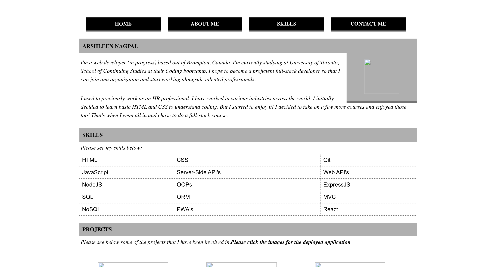

# React Portfolio

## Project Description

This application is a place nto show off my projects while I am applying for jobs or working as a freelancer but also to share my work with other developers and collaborate on projects.

My portfolio uses React. 

## User Story

```md
AS AN employer looking for candidates with experience building single-page applications
I WANT to view a potential employee's deployed React portfolio of work samples
SO THAT I can assess whether they're a good candidate for an open position
```

## Screenshot

The following image shows the application's appearance and functionality:



The URL of the Heroku application is: 
<https://akn-react-portfolio.herokuapp.com/>

The URL of the GitHub repository is: 
<https://github.com/ArshleenKNagpal/React-Portfolio>


- - -
© 2021 Trilogy Education Services, a 2U, Inc. brand. All Rights Reserved.
